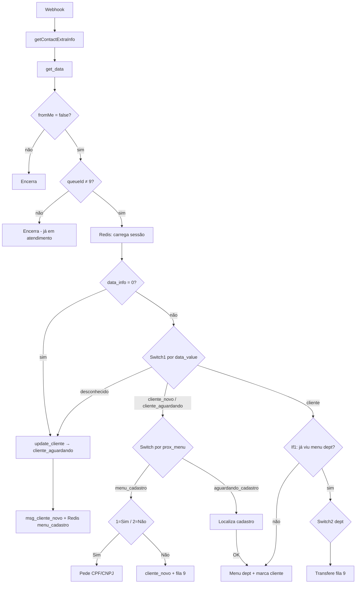

# Chat Alpha — Documentação do Workflow

**Arquivo:** `worflows/chat_alpha.json`  
**Nome no n8n:** `chat_alpha`  
**Webhook:** `POST /app-test`  
**Status:** Inativo (`active: false`) — ativar após importar e validar credenciais

---

## Objetivo

Automatizar o primeiro contato no WhatsApp da Alpha-Software com um chatbot orientado a **menus com botões**. O fluxo:

1. Identifica se o contato **já é cliente** ou não.
2. Se **sim** → solicita CPF/CNPJ, localiza cadastro na API interna, grava dados no Z-Pro e exibe menu de departamentos.
3. Se **não** → marca como `cliente_novo` e **transfere para atendente humano**.
4. Se **já é cliente confirmado** → exibe menu de departamentos e transfere para a fila escolhida.

> **Modo de teste atual:** Baileys via Z-Pro, com botões simulados em texto (`btn1 - Sim`, `btn2 - Não`, etc.). O workflow já normaliza respostas de botões/listas da API oficial do WhatsApp para facilitar a migração.

---

## Stack e dependências

| Componente | Uso |
|------------|-----|
| **n8n** | Orquestração do fluxo |
| **Z-Pro (Alpha API)** | Envio de mensagens, filas, extraInfo e cadastro do contato |
| **Redis** | Sessão temporária por `remoteJid` |
| **API Alpha interna** | Localização de cadastro por documento |

### Credenciais necessárias

| Credencial n8n | Nós que usam |
|----------------|--------------|
| `auth z-pro` (Bearer) | Todos os HTTP Request para Z-Pro |
| `Redis account` | `Redis`, `new_cliente`, `new_cliente1`, `set_menus`, `Redis3`, `Redis4` |

### URLs base

| Serviço | URL |
|---------|-----|
| Z-Pro external API | `https://api.alphasoftware.com.br/v2/api/external/0d01754a-451d-4440-aa03-faea5563b94e/` |
| Localizar cadastro | `http://host.docker.internal:5001/api/chatbot/identificacao/localizar` |

---

## Entrada do fluxo

### Webhook (`Webhook1`)

- **Método:** POST  
- **Path:** `app-test`  
- **Origem:** evento de mensagem recebida pelo Z-Pro / Baileys

### Campos extraídos (`get_data`)

| Campo | Origem | Descrição |
|-------|--------|-----------|
| `cpf` | `body.ticket.contact.cpf` | CPF já salvo no contato |
| `clienteID` | `body.ticket.contact.id` | ID do contato no Z-Pro |
| `Number` | `body.ticket.contact.number` | Telefone |
| `conversation` | Vários formatos de mensagem* | Resposta do usuário |
| `remoteJid` | `body.msg.key.sender_pn` | Identificador da sessão WhatsApp |
| `whatsappId` | `body.ticket.whatsappId` | Instância WhatsApp |
| `ticketID` | `body.ticket.id` | ID do ticket |
| `queueId` | `body.ticket.queueId` | Fila atual do ticket |
| `fromMe` | `body.msg.key.fromMe` | Se a mensagem foi enviada pelo bot |
| `data_info` | `pagination.total` da API extraInfo | `0` = primeiro contato sem extraInfo |
| `data_value` | `data[0].value` da API extraInfo | Estado do contato na plataforma |

\* O campo `conversation` aceita:

- `message.conversation` (texto simples — Baileys)
- `extendedTextMessage.text`
- `buttonsResponseMessage.selectedButtonId`
- `listResponseMessage.singleSelectReply.selectedRowId`
- `interactive.button_reply.id`
- `interactive.list_reply.id`

### Filtros iniciais

| Nó | Condição | Comportamento |
|----|----------|---------------|
| `if_fromMe` | `fromMe === false` | Ignora mensagens enviadas pelo próprio bot |
| `if_queue` | `queueId !== 9` | Bot só atua fora da fila de atendimento humano (fila **9** = teste) |

---

## Máquina de estados

O fluxo usa **dois repositórios de estado** em paralelo:

### 1. Z-Pro — `extraInfo` (campo `cliente`)

Persistente na plataforma. Consultado via `getContactExtraInfo`.

| Valor | Significado |
|-------|-------------|
| *(vazio / inexistente)* | Primeiro contato — `data_info === 0` |
| `cliente_aguardando` | Passou pela pergunta inicial; aguardando confirmação ou documento |
| `cliente_novo` | Informou que **não** é cliente; transferido para humano |
| `cliente` | Cadastro localizado e confirmado; liberado para menu de departamentos |

### 2. Redis — `navegacao.prox_menu`

Sessão temporária. TTL: **1800 s (30 min)**.

| Chave Redis | `status:{remoteJid}` |
|-------------|----------------------|
| Campo | `navegacao.prox_menu` |

| Valor | Significado |
|-------|-------------|
| `menu_cadastro` | Aguardando resposta "já é cliente?" (1 = Sim, 2 = Não) |
| `aguardando_cadastro` | Aguardando envio de CPF/CNPJ |
| `menu_departamento_primeiro_contato` | Aguardando escolha de departamento (1, 2 ou 3) |

---

## Diagrama geral



---

## Jornadas do usuário

### Jornada A — Primeiro contato (não é cliente)

| Passo | Usuário | Bot / Sistema |
|-------|---------|---------------|
| 1 | Envia qualquer mensagem | `update_cliente` → `cliente_aguardando`; pergunta sim/não; Redis → `menu_cadastro` |
| 2 | `2` (Não) | `update_cliente_novo` → `cliente_novo`; mensagem de transferência; fila **9**; limpa Redis |

### Jornada B — Primeiro contato (é cliente)

| Passo | Usuário | Bot / Sistema |
|-------|---------|---------------|
| 1 | Envia qualquer mensagem | Pergunta sim/não; Redis → `menu_cadastro` |
| 2 | `1` (Sim) | Pede CPF/CNPJ; Redis → `aguardando_cadastro` |
| 3 | Envia documento | Busca na API; se OK → salva CPF, marca `cliente`, exibe menu departamentos |
| 4 | `1`, `2` ou `3` | Transfere para fila **9** (teste — todas as opções na mesma fila) |

### Jornada C — Cliente já confirmado (`data_value = cliente`)

| Passo | Usuário | Bot / Sistema |
|-------|---------|---------------|
| 1 | Envia mensagem | Se Redis sem menu dept → exibe menu; se já tem → `Switch2` processa opção |
| 2 | `1`, `2` ou `3` | Transfere fila **9**; limpa Redis |

---

## Menus e opções

### Menu 1 — Apresentação (`msg_cliente_novo`)

```
Olá! 👋 Seja bem-vindo à Alpha-Software, você já é nosso cliente?
btn1 - Sim
btn2 - Não
```

| Entrada | Ação |
|---------|------|
| `1` | Pede CPF/CNPJ |
| `2` | Marca `cliente_novo` + transfere |
| Outro | Mensagem de erro + reenvia menu |

### Menu 2 — Documento (`msg_menu_1`)

```
CNPJ/CPF do seu cadastro
```

- Aceita apenas conteúdo não vazio (números extraídos via `replace(/\D/g, '')`).
- Consulta `POST /api/chatbot/identificacao/localizar` com `{ documento }`.

### Menu 3 — Departamentos (`msg_menu_` / `msg_menu_reenvio`)

```
Escolha o departamento:
btn1 - Suporte
btn2 - Financeiro e Com.
btn3 - Agrotech
```

| Entrada | Fila (teste) |
|---------|--------------|
| `1` | 9 |
| `2` | 9 |
| `3` | 9 |
| Outro | Erro + reenvia menu |

---

## Mapa de nós

### Entrada e roteamento

| Nó | Tipo | Função |
|----|------|--------|
| `Webhook1` | Webhook | Recebe evento |
| `HTTP Request1` | HTTP GET | `getContactExtraInfo` |
| `get_data` | Set | Normaliza payload |
| `if_fromMe` | If | Filtra mensagens do bot |
| `if_queue` | If | Filtra tickets fora da fila 9 |
| `Redis` | Redis GET | Carrega `status:{remoteJid}` |
| `Merge` / `data_redis` | Merge + Set | Expõe sessão Redis |
| `If` | If | Primeiro contato (`data_info === 0`) |
| `Switch1` | Switch | Roteia por `data_value` |
| `Switch` | Switch | Roteia por `prox_menu` (Redis) |

### Cadastro e identificação

| Nó | Função |
|----|--------|
| `update_cliente` | Grava `cliente_aguardando` no Z-Pro |
| `update_cliente_novo` | Grava `cliente_novo` no Z-Pro |
| `update_nosso_cliente` | Grava `cliente` no Z-Pro |
| `update_data_cliente` | Salva CPF/CNPJ no contato (`updateContact`) |
| `resposta_apresentação` | Switch 1=Sim / 2=Não |
| `If5` | Valida mensagem não vazia |
| `get_documento` | Remove caracteres não numéricos |
| `buscando` | Mensagem "buscando cadastro..." |
| `Api_alpha localizar` | Consulta cadastro |
| `encontrado1` | Verifica `sucesso === true` |
| `localizado` | Confirma cadastro encontrado |

### Menus e mensagens

| Nó | Função |
|----|--------|
| `msg_cliente_novo` | Pergunta sim/não |
| `msg_menu_1` | Pede documento |
| `msg_menu_` | Exibe menu departamentos (primeira vez) |
| `msg_menu_reenvio` | Reexibe menu departamentos (sem regravar cadastro) |
| `msg_transferencia` | Aviso de transferência |
| `msg_cliente_novo1` | "Não entendi, selecione uma opção" |
| `msg_documento_vazio` | Pede CPF/CNPJ quando mensagem vazia |

### Cliente confirmado

| Nó | Função |
|----|--------|
| `If1` | Verifica se `prox_menu === menu_departamento_primeiro_contato` |
| `Switch2` | Roteia opção 1/2/3 do menu departamentos |
| `set_menus` | Grava `menu_departamento_primeiro_contato` no Redis |

### Sessão Redis

| Nó | Operação | Valor `prox_menu` |
|----|----------|-------------------|
| `new_cliente` | SET | `menu_cadastro` |
| `new_cliente1` | SET | `aguardando_cadastro` |
| `set_menus` | SET | `menu_departamento_primeiro_contato` |
| `Redis3` / `Redis4` | DELETE | `status:{remoteJid}` |

### Transferência e fallbacks

| Nó | Função |
|----|--------|
| `Transferencia de fila de atendimento` | Transfere para fila 9 (não cliente) |
| `Transferencia de fila de atendimento1` | Transfere para fila 9 (departamento) |
| `login invalido1` | Exibe erro da API + pede documento novamente |
| `erro_api_localizar` | Formata erro quando API de localização falha |
| `reenviar_menu` | Reenvia menu correto após opção inválida |

---

## Tratamento de erros e fallbacks

| Situação | Nó | Comportamento |
|----------|-----|---------------|
| Opção inválida no menu sim/não | `resposta_apresentação` → `msg_cliente_novo1` → `reenviar_menu` | Reexibe menu de cadastro |
| Opção inválida no menu departamentos | `Switch2` → `msg_cliente_novo1` → `reenviar_menu` | Reexibe menu departamentos |
| `prox_menu` desconhecido no Redis | `Switch` fallback → `reenviar_menu` | Reenvia menu conforme estado |
| `data_value` desconhecido | `Switch1` fallback → `update_cliente` | Trata como primeiro contato |
| Mensagem vazia no passo do documento | `If5` false → `msg_documento_vazio` | Pede CPF/CNPJ |
| Cadastro não encontrado | `encontrado1` false → `login invalido1` → `msg_menu_1` | Erro + nova tentativa |
| Falha HTTP na localização | `Api_alpha localizar` erro → `erro_api_localizar` → `login invalido1` | Erro genérico + nova tentativa |
| Após transferência | `Redis3` → `Redis4` | Limpa sessão Redis |

---

## APIs Z-Pro utilizadas

| Endpoint | Método | Nó(s) |
|----------|--------|-------|
| `/getContactExtraInfo?contactId=` | GET | `HTTP Request1` |
| `/` (enviar mensagem) | POST | Todos os `msg_*` |
| `/updateContactExtraInfo` | POST | `update_cliente`, `update_cliente_novo`, `update_nosso_cliente` |
| `/updateContact` | POST | `update_data_cliente` |
| `/updatequeue` | POST | `Transferencia de fila de atendimento*` |

### Payload de transferência (`updatequeue`)

```json
{
  "ticketId": "<ticketID>",
  "userId": null,
  "status": "pending",
  "queueId": 9,
  "n8nStatus": false,
  "chatFlowId": null
}
```

### Payload extraInfo

```json
{
  "contactId": "<clienteID>",
  "extraInfo": [
    { "name": "cliente", "value": "cliente_aguardando | cliente_novo | cliente" }
  ]
}
```

---

## Estrutura da sessão Redis

```json
{
  "navegacao": {
    "prox_menu": "menu_cadastro | aguardando_cadastro | menu_departamento_primeiro_contato",
    "cliente": ""
  }
}
```

- **Chave:** `status:{remoteJid}`  
- **TTL:** 1800 segundos

---

## Plano de testes

| # | Cenário | Entrada | Resultado esperado |
|---|---------|---------|-------------------|
| 1 | Primeiro contato | Qualquer texto | Pergunta sim/não; `cliente_aguardando` no Z-Pro |
| 2 | Não é cliente | `2` | `cliente_novo`; transferência fila 9; Redis limpo |
| 3 | É cliente | `1` → CPF válido | Cadastro localizado; `cliente`; menu departamentos |
| 4 | CPF inválido | Documento inexistente | Mensagem de erro; pede documento novamente |
| 5 | API localizar fora | CPF qualquer com API down | Mensagem de erro genérica; pede documento novamente |
| 6 | Opção inválida apresentação | `9` | "Não entendi" + menu sim/não reenviado |
| 7 | Opção inválida departamentos | `9` | "Não entendi" + menu departamentos reenviado |
| 8 | Mensagem vazia no CPF | *(vazio)* | Pede CPF/CNPJ |
| 9 | Cliente confirmado | `1` no menu dept | Transferência fila 9 |
| 10 | Já em fila 9 | Qualquer | Bot não responde (`if_queue` bloqueia) |
| 11 | Mensagem do bot | `fromMe: true` | Bot não responde |

---

## Migração para API oficial do WhatsApp

O workflow já lê respostas interativas no campo `conversation`. Para produção com botões reais:

1. Substituir corpo de texto (`btn1 - Sim`) por payload de **Reply Buttons** ou **List Message** na API oficial/Meta.
2. Mapear IDs dos botões para `1`, `2`, `3` **ou** ajustar as condições nos nós `Switch`/`resposta_apresentação`/`Switch2` para os IDs reais (ex.: `btn_sim`, `btn_nao`).
3. Manter a mesma máquina de estados (`extraInfo` + Redis) — a lógica de roteamento não precisa mudar.

---

## Configuração e deploy

1. Importar `worflows/chat_alpha.json` no n8n.
2. Configurar credenciais `auth z-pro` e `Redis account`.
3. Confirmar que o webhook Z-Pro aponta para `POST .../webhook/app-test` (ou URL de produção do n8n).
4. Validar conectividade com `host.docker.internal:5001` (API de localização) a partir do container n8n.
5. Ajustar `queueId: 9` quando houver filas reais por departamento.
6. Ativar o workflow.

---

## Limitações conhecidas

| Item | Detalhe |
|------|---------|
| Fila única de teste | Opções 1, 2 e 3 do menu departamentos transferem todas para fila **9** |
| `HTTP Request1` sem `onError` | Falha em `getContactExtraInfo` interrompe o fluxo |
| `if_fromMe` / `if_queue` sem ramo alternativo | Comportamento intencional — bot silencia nesses casos |
| Menu departamentos na 1ª exibição (`If1` false) | `msg_menu_` → `set_menus` dispara `update_data_cliente`, que depende de `get_documento` já executado no fluxo de cadastro |

---

## Referências

- Workflow: `worflows/chat_alpha.json`
- Chatbot completo (faturas, CCR, etc.): `worflows/chatbot integração com z-pro teste.json`
- Estados do chatbot legado: `documentation/estados.md`
