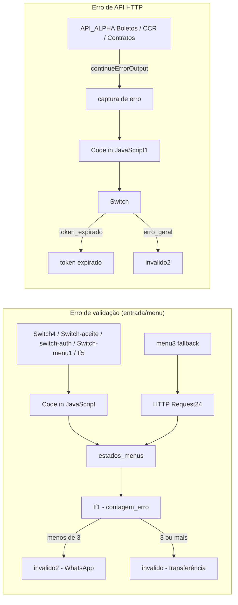
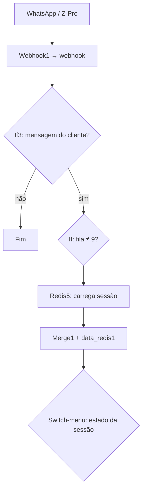
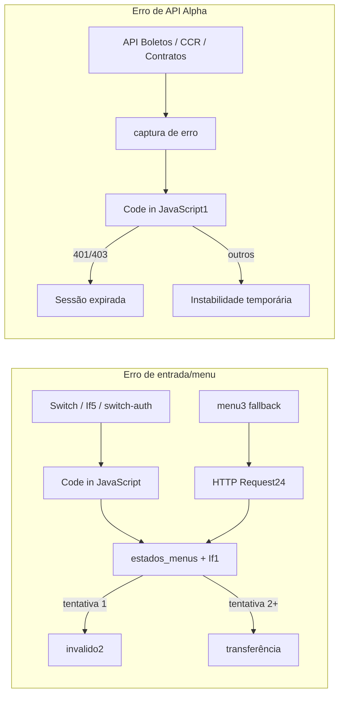

# Chatbot integração com Z-Pro — Documentação do fluxo

Workflow: `chatbot integração com z-pro.json`

Este documento descreve o fluxo conversacional do chatbot WhatsApp integrado ao Z-Pro, o tratamento de erros e os estados de sessão armazenados no Redis.

---

## Correções aplicadas no workflow

| # | Alteração |
|---|-----------|
| 1 | **`Code in JavaScript`** — máquina de estados completa por `menu_atual`; prioriza `menu3.mensagem_texto` no fallback; separou `selecione_boleto` de `AGUARDANDO_CONFIRMAR` |
| 2 | **`Switch-menu1` fallback** → `marca erro menu` → `HTTP Request24` (mensagem contextual do `menu3`) |
| 3 | **`captura de erro`** — corrigido `menssage` → `mensagem_erro` |
| 4 | **`Code in JavaScript1`** — `Number(status)` + checagem segura de `mensagem` |
| 5 | **`Switch`** — roteia `token_expirado` e `erro_geral`; ambos enviam WhatsApp via `token expirado` / `invalido2` |
| 6 | **`switch-auth`** — saída `token invalido` conectada ao `Code in JavaScript` |
| 7 | **`estados_menus`** — reativado (estava desabilitado) para contagem de erros funcionar |
| 8 | Novos nós: **`Switch-apos-menu24`**, **`Switch-pos-if1`**, **`marca erro menu`** — evitam mensagem duplicada no fallback de menu |

---

## Visão geral: dois caminhos de erro



### Nós cobertos pelo fallback de validação

| Nó origem | Quando dispara |
|-----------|----------------|
| **Switch4** (extra) | Resposta inválida no estado `autorizado` (não é 1 nem 2) |
| **Switch-aceite** (extra) | Resposta inválida no aceite inicial (não é 1 nem 2) |
| **switch-auth** (extra / token invalido) | Estado de auth não reconhecido ou sessão inválida |
| **Switch-menu1** (fallback) | Opção inválida no menu logado (`menu3` → `rota_destino: "fallback"`) |
| **If5** (false) | Mensagem vazia após sanitização no fluxo de CPF (`get_data1`) |

**Caminho:** origem → `Code in JavaScript` (ou `HTTP Request24` no fallback de menu) → `estados_menus` → `If1` → `invalido2` ou `invalido` (transferência).

### Nós cobertos pelo fallback de API

| Nó | Saída de erro |
|----|---------------|
| **API_ALPHA(Boletos)2** | `captura de erro` |
| **API_ALPHA(Boletos)** | `captura de erro` |
| **API_ALPHA(Ccr)1** | `captura de erro` |
| **API_ALPHA(Contratos)1** | `captura de erro` |

### Fallbacks dedicados (fora do fluxo central)

| Nó | Tratamento |
|----|------------|
| **Api_alpha localizar** | Erro → `login invalido1` |
| **Api_alpha autenticar** | Erro → `Switch1` → `invalido3` (401) ou `invalido4` (500) |

---

## Fluxo do chat — passo a passo

### Fase 0 — Entrada (toda mensagem)



| Passo | O que acontece |
|-------|----------------|
| 0.1 | Z-Pro envia POST ao webhook com texto, telefone e ticket |
| 0.2 | Sessão carregada do Redis (`status:{remoteJid}`) |
| 0.3 | `Switch-menu` roteia pelo `auth.estado_anterior` e `auth.logado` |

**Saídas do `Switch-menu`:**

| Saída | Estado / condição | Destino |
|-------|-------------------|---------|
| logof | Mensagem contém "sair" | `Redis3` → encerra sessão |
| cliente novo | `estado_anterior = cliente_novo` | `Switch-aceite` |
| autenticado | `auth.logado = true` | `menu3` (navegação de menus) |
| autorizado | `estado_anterior = autorizado` | `Switch4` |
| aguardando_cpf / login / aguardando_confirmar / token invalido | Estados de autenticação | `switch-auth` |
| extra (fallback) | Sem estado reconhecido | `apresentecao` (novo usuário) |

---

### Fase 1 — Primeiro contato (sem sessão / estado desconhecido)

| Passo | Bot pergunta | Usuário responde | Próximo estado |
|-------|--------------|------------------|----------------|
| 1.1 | Boas-vindas Preserva (`apresentecao`) | — | — |
| 1.2 | "Você já é nosso cliente? **1** sim / **2** não" (`apresentação 3`) | — | `cliente_novo` |
| 1.3 | — | **1** | `autorizado` → validação de dados |
| 1.4 | — | **2** | Transferência comercial (`transferencia1`) |
| 1.5 | — | Outro | Mensagem de erro contextual → até 2 tentativas, depois transferência |

---

### Fase 2 — Validação de dados (estado `autorizado`)

| Passo | Bot pergunta | Usuário responde | Resultado |
|-------|--------------|------------------|-----------|
| 2.1 | "Deseja continuar? **1** sim / **2** não" (`Switch4`) | **1** | Pede CPF/CNPJ (`aceite1`) → `AGUARDANDO_CPF` |
| 2.2 | — | **2** | Transferência para atendente |
| 2.3 | — | Inválido | Erro contextual → contagem de tentativas |

---

### Fase 3 — Identificação por documento (estado `AGUARDANDO_CPF`)

| Passo | Bot pergunta | Usuário responde | Resultado |
|-------|--------------|------------------|-----------|
| 3.1 | "Informe CPF ou CNPJ (só números)" | Documento válido | `buscando` → API `localizar` |
| 3.2 | — | Documento não encontrado | "Cadastro não encontrado" + contagem de erro |
| 3.3 | API OK | — | "Cadastro localizado — 4 primeiros dígitos do CPF" → `AGUARDANDO_CONFIRMAR` |
| 3.4 | — | 4 dígitos corretos | Autenticação (`Api_alpha autenticar`) |
| 3.5 | — | 4 dígitos errados | Erro de confirmação de segurança |
| 3.6 | Auth OK | — | Login completo → `autenticado_autorizado` + Menu Principal |

**Erros de API na autenticação:**

| Código | Ação |
|--------|------|
| 401 | `invalido3` — credencial inválida |
| 500 | `invalido4` → transferência para atendente |

---

### Fase 4 — Menu principal (logado: `autenticado_autorizado`)

| Opção | Ação do bot |
|-------|-------------|
| **1** | Busca faturas → lista boletos → usuário escolhe número → envia PDF |
| **2** | Submenu CCR (1/3/6 últimos) → busca e envia comprovantes |
| **3** | Link plataforma MTR/certificados + dados de acesso |
| **4** | Submenu contratos → busca e envia |
| **9** | Transferência para atendente humano |
| **Sair** | Encerra sessão (`logof1`) |
| Inválido | Reenvia menu com opções (`HTTP Request24` + contagem de erro) |

---

### Fase 5 — Submenus

#### 5A — Faturas (`selecione_boleto`)

| Passo | Fluxo |
|-------|-------|
| Lista faturas numeradas | Usuário digita número da opção |
| OK | Gera e envia PDF do boleto |
| **0** | Volta ao menu principal |
| **9** | Atendente |
| Inválido | Mensagem com instruções de seleção de boleto |

#### 5B — CCR (`Meus_CCR` → `buscar_ccr`)

| Opção | Resultado |
|-------|-----------|
| **1** | Último CCR |
| **2** | Últimos 3 CCRs |
| **3** | Últimos 6 CCRs |
| **0** | Volta ao menu |
| **9** | Atendente |
| Inválido | Mensagem com opções do submenu CCR |

#### 5C — Cliente bloqueado/inativo

| Situação | Resultado |
|----------|-----------|
| Cadastro inativo ou bloqueado | Aviso + transferência automática (`cliente_bloqueado`) |

---

### Fase 6 — Tratamento de erros



| Tipo de erro | Mensagem enviada |
|--------------|------------------|
| Opção inválida no menu logado | Menu completo com opções (via `menu3` / `HTTP Request24`) |
| Opção inválida na autenticação | Mensagem específica do estado (CPF, 4 dígitos, sim/não) |
| API Alpha falha (rede/servidor) | "Instabilidade temporária — tente novamente" |
| Token expirado (401/403) | "Sessão expirada — envie qualquer mensagem para reiniciar" |
| 2+ tentativas inválidas (`contagem_erro ≥ 2`) | "Muitas tentativas" + transferência para humano |

**Contagem de erros:** o nó `estados_menus` incrementa `navegacao.contagem_erro` no Redis. O `If1` verifica se `contagem_erro === 2` (após incremento) para acionar transferência.

**Fallback de menu sem duplicata:** quando o erro vem do `Switch-menu1` (fallback), o fluxo passa por `marca erro menu` → `HTTP Request24` (envia a mensagem) → `Switch-apos-menu24` → `estados_menus` → `If1` → `Switch-pos-if1` (não reenvia via `invalido2` se a mensagem já foi enviada).

---

## Mapa de estados da sessão (Redis)

Chave: `status:{remoteJid}` — TTL: 1800 segundos (30 min)

### `auth.estado_anterior`

| Valor | Significado |
|-------|-------------|
| `cliente_novo` | Aguardando "já é cliente?" |
| `autorizado` | Aguardando aceite de validação (1/2) |
| `AGUARDANDO_CPF` | Aguardando CPF/CNPJ |
| `AGUARDANDO_CONFIRMAR` | Aguardando 4 dígitos do CPF do responsável |
| `autenticado_autorizado` | Logado no menu principal |
| `token_invalido` | Sessão expirada, precisa reautenticar |

### `navegacao.menu_atual`

| Valor | Significado |
|-------|-------------|
| `Menu_Principal` | Menu principal |
| `Meus_CCR` | Submenu de comprovantes |
| `buscar_ccr` | Seleção de quantidade de CCRs |
| `selecione_boleto` | Escolha de fatura para PDF |
| `fluxo_finalizado` | Após envio de documento |

### Outros campos relevantes

| Campo | Uso |
|-------|-----|
| `auth.logado` | `true` quando autenticado com token válido |
| `auth.token` | JWT da API Alpha |
| `navegacao.contagem_erro` | Tentativas inválidas consecutivas |
| `navegacao.faturas_disponiveis` | Lista de boletos para seleção |

---

## Mensagens de erro por estado (`Code in JavaScript`)

| Condição | Mensagem |
|----------|----------|
| `cliente_novo` ou menu vazio (não logado) | Responda **1** SIM ou **2** NÃO |
| `autorizado` | **1** confirmar validação ou **2** cancelar |
| `AGUARDANDO_CPF` | CPF/CNPJ inválido — envie só números |
| `AGUARDANDO_CONFIRMAR` | 4 primeiros dígitos do CPF do titular |
| `selecione_boleto` | Opção inválida + instruções de seleção de boleto |
| `buscar_ccr` | Opção inválida + opções de quantidade de CCR |
| `Meus_CCR` | Opção inválida + submenu CCR |
| `Menu_Principal` / `autenticado_autorizado` | Opção inválida + menu principal |
| `fluxo_finalizado` | **1** voltar ao menu ou **2** atendente |
| `token_invalido` | Sessão expirada — reinicie identificação |
| Fallback `menu3` (`rota_destino: fallback`) | Usa `menu3.mensagem_texto` (menu completo contextual) |

---

## Integrações externas

| Serviço | Uso |
|---------|-----|
| **Z-Pro API** (`api.alphasoftware.com.br`) | Envio de mensagens WhatsApp, transferência de fila, envio de PDF/base64 |
| **API Alpha** (`host.docker.internal:5001`) | Localizar cadastro, autenticar, faturas, CCR, contratos, arquivo PDF |
| **Redis** | Persistência de sessão e estado do chatbot |

---

## Referência rápida do fluxo completo

```
Mensagem WhatsApp
  → Webhook → Carrega sessão (Redis)
  → Switch-menu (por estado)
      → Novo usuário: Boas-vindas → Já é cliente? (1/2)
      → Autorizado: Aceita validação? (1/2) → CPF/CNPJ
      → Aguardando CPF: Localiza cadastro → 4 dígitos CPF
      → Aguardando confirmar: Autentica → Menu Principal
      → Logado: menu3 → Switch-menu1
          → Faturas / CCR / MTR / Contratos / Atendente
      → Sair: Encerra sessão
      → Erros: mensagem contextual + contagem → transferência se exceder limite
```
